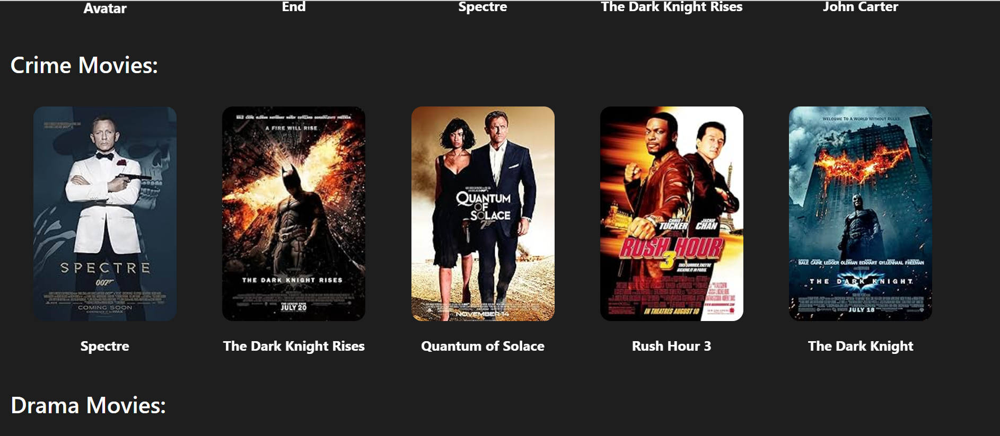

# Assigment 3
## Testing
## Memebers:
## Shubarna Shunuwar - 0781476
## Vu Anh Thu Nguyen - 0746579

## Login page

## Homepage

When hovering over the movie poster, overlay buttons appear for viewing movie details and a heart icon to move the movie to the "To Watch" list:

## Search bar
Attempting to search for "Harry" returns a list of Harry Potter movies

## Movie Detail page:

## Added movie to Watch Later:

## To-watch page:

## To-watch page after updating movies' priorities as:
Spectre: 4
Avatar: 8 
Pirates of the Carribean: 9
John Carter: 1
Dark Knight: 3

Database before and after:

## Remove movie from to-watch list
Clicking on the red heart will remove the movie from the to-watch list

## Hovering over movie poster on to-watch page:

## Added movie to Completed List:
Right now the movies are sorted by Date Watched, with the most recently watched movie appearing at the bottom of the lis

After updating the ratings for each movie, they are sorted by ratings:

Database before and after:

